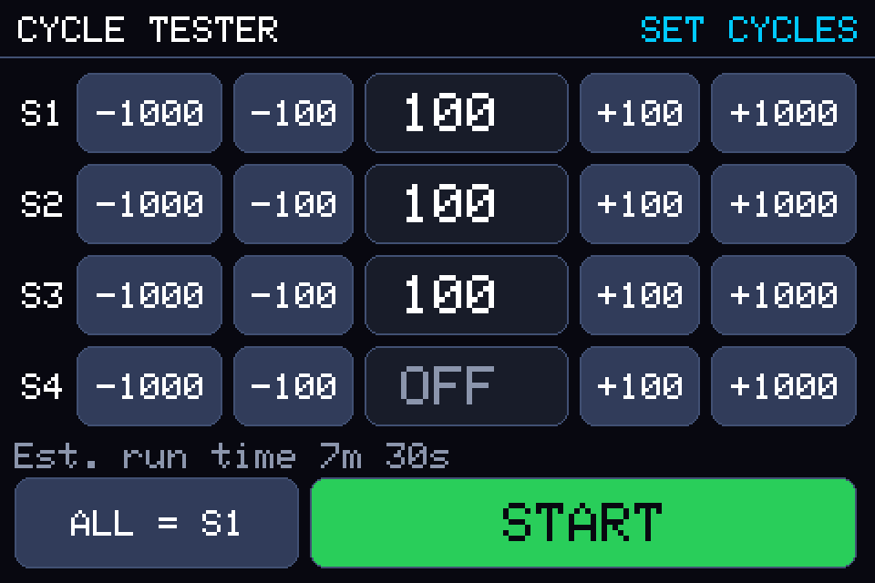
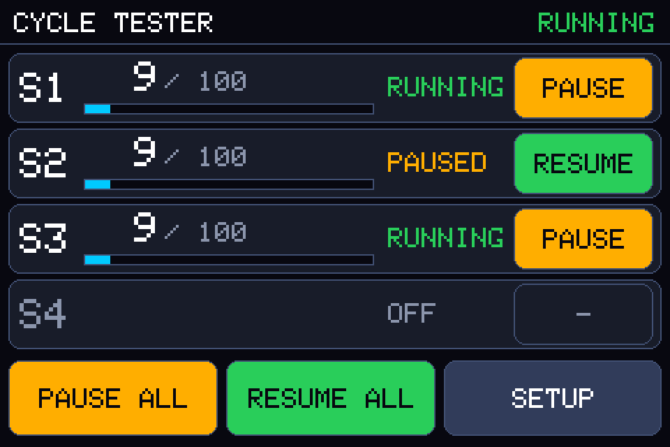
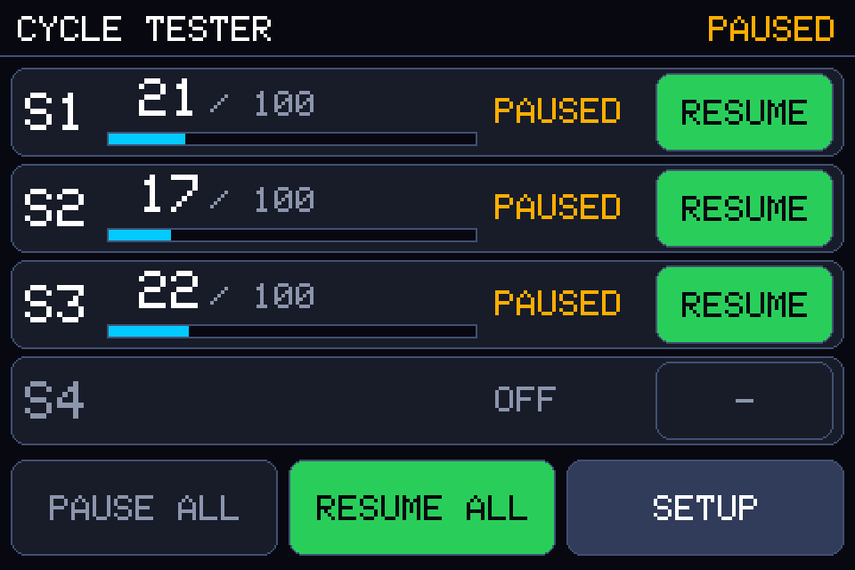
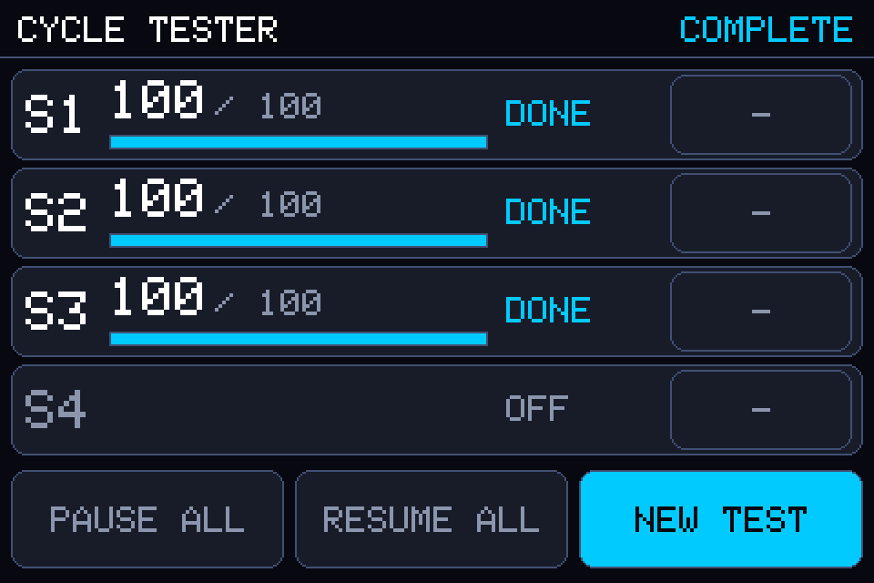

# Cycle Tester

A four-servo cycle-testing robot for an Arduino Mega with a touchscreen. Pick how many cycles each servo should
do, press START, and watch the counters. Each servo sweeps 180°, returns to its start position, and counts one
cycle. Servos can be paused and resumed individually or all at once.

| Folder | What it is |
|---|---|
| `CycleTester/` | **The sketch.** Open `CycleTester/CycleTester.ino` in the Arduino IDE. |
| `tools/ServoRangeTest/` | A small helper sketch to measure your servos' real travel. **Run this first.** |
| `tests/host/` | A PC simulation of the sketch (no hardware needed), used to test the logic and preview the screens. |
| `SATv3_oasistest/` | Your earlier Snap & Test sketch, untouched. |

## 1. Set up

**Board:** Arduino Mega 2560.

**Libraries** (Library Manager, unless noted):

| Library | Notes |
|---|---|
| ServoEasing (Armin Joachimsmeyer) | Tested against 3.6.0. Installs the Servo library it needs. |
| Adafruit FT6206 Library | Also needs **Adafruit BusIO** (the Library Manager offers to install it). |
| LCDWIKI_SPI and LCDWIKI_gui | The copies you used for the Snap & Test sketch, from the Hosyond / LCDWIKI download. They must be the versions that know the `ST7796S` display. The public GitHub copy of `LCDWIKI_SPI` does not. |

Compile and upload `CycleTester/CycleTester.ino`. Nothing moves at power-up: the servos get no signal until you press START.

## 2. Wiring

Your existing pins, unchanged (they are also written at the top of `Config.h`):

| Servo | Pin | | Display / touch | Pin |
|---|---|---|---|---|
| Servo 1 | 5 | | LCD_CS | 8 |
| Servo 2 | 6 | | LCD_RST | 7 |
| Servo 3 | 3 | | LCD_RS (DC) | 9 |
| Servo 4 | 4 | | SDI / SCK / SDO | 51 / 52 / 50 |
| | | | CTP_INT | 2 |
| | | | CTP_SDA / CTP_SCL | SDA / SCL |
| | | | CTP_RST, LED, VCC | 3.3 V, 5 V, 5 V |

Note: the old sketch also declared `CTP_RST` as pin 6, which is Servo 2's pin. Because CTP_RST is wired to 3.3 V
that did nothing useful, and it is not repeated here.

### Servo power (read this before connecting four servos)

* The ANNIMOS 35 KG servo is rated 5 – 8.4 V; 7.4 V is the nominal figure. Never exceed 8.4 V.
* Seller listings for this servo family show a **stall current of about 3 A each at 7.4 V**, so four servos can in
  theory ask for ~13 A. A lightly loaded fixture draws far less, but use a regulated supply sized for your measured
  peak (10 A or more is a sensible starting point), a fuse in the servo supply line, and thick wire.
* **Do not power the servos from the Mega's 5 V pin.** Give them their own supply and **connect its ground to the
  Mega's GND**, otherwise the signal has no reference ([Arduino Servo reference](https://reference.arduino.cc/reference/en/libraries/servo)).
* Power the Mega from USB (or its own adapter), not from the servo rail. A servo current spike can otherwise reset it.
* Put a large capacitor (a couple of thousand µF, 16 V or more) across the servo supply near the servos.
* Put a switch in the servo supply line. It is your emergency stop.
* Servos are started 250 ms apart (`START_STAGGER_MS`) so they do not all draw their start-up current at once.

## 3. First run, in this order

1. **Run `tools/ServoRangeTest`** (Serial Monitor, 115200 baud, line ending "Newline"). Servos powered, **no product on the fixture**.
   * Type `all 1500` (centre). Then step each way, e.g. `1 600`, `1 550`, `1 500`, and `1 2400`, `1 2500`.
   * Find the pulse width where the arm reaches each physical end, and stop where it stops moving or the servo hums.
   * Measure the angle between the `500` and `2500` positions. **That tells you whether yours are 180° or 270° servos.**
     Sellers list this ANNIMOS 35 KG family both ways, and the listing for your exact model contradicts itself.
2. **Edit `CycleTester/Config.h`** to match (section "SERVO CALIBRATION"):
   * 180° servo: leave `SERVO_FULL_TRAVEL_DEG = 180` and `SWEEP_START_OFFSET_DEG = 0` (sweep = 500 → 2500 µs).
   * 270° servo: `SERVO_FULL_TRAVEL_DEG = 270` and `SWEEP_START_OFFSET_DEG = 45` (sweep = 833 → 2167 µs, centred).
   * If one servo needs trimming, overwrite its entry in `SERVO_START_US[]` / `SERVO_END_US[]`.
3. Upload `CycleTester`, run a short test (100 cycles) with a light load, and watch the first few cycles.

## 4. Using it

These are renders produced by the PC simulation (`tests/host`) using the display library's own drawing routines, so layout and colours are what the screen should show. They are not photos of the real display.

| Setup | Running, one servo paused | All paused | Finished |
|---|---|---|---|
|  |  |  |  |

**Setup screen:** each servo has `-1000 -100 [count] +100 +1000` buttons. Hold a button to repeat. `OFF` (0) leaves that
servo out of the test. `ALL = S1` copies servo 1's count to every servo. The estimated run time is shown above START.

**Run screen:** each row shows the cycle count, the target, a progress bar, the state, and a **PAUSE / RESUME** button for that servo.
The bottom bar has **PAUSE ALL**, **RESUME ALL** and **SETUP**. SETUP asks "SURE?" (tap again within 3 s) because it ends
the test and the counts are lost. When everything has finished it becomes **NEW TEST**.

How it behaves:

* **One cycle** = start position → 180° → back to the start. The counter goes up each time a servo gets back to the start.
* **Pause** freezes the servo exactly where it is. It stays powered and keeps holding that position (and its current draw and heat), so do not leave a loaded servo paused for hours. **Resume** carries on from that spot.
* When a servo reaches its target it stops, settles, and is released (no signal, so it is silent and cool). Set `DETACH_WHEN_DONE = false` to make it hold the start position instead.
* **SETUP** while running sends the servos slowly back to their start position, then releases them.
* Counts are kept in RAM only. A power cut ends the test and loses the counts.
* Changing screens redraws everything, which takes about 2.5 s on this display. Tapping is ignored briefly afterwards.

## 5. Settings (`CycleTester/Config.h`)

| Setting | Default | Meaning |
|---|---|---|
| `SERVO_SPEED_DEG_PER_SEC` | 90 | **The universal speed.** One 180° sweep takes `180 / speed` seconds. Allowed 5 – 400. |
| `SERVO_EASING` | `EASING_SINE` | Ramp up and down. With sine easing the peak speed is ~1.57× the setting. `EASING_LINEAR` = constant speed. |
| `DWELL_AT_END_MS` / `DWELL_AT_START_MS` | 250 / 250 | Rest at each end before reversing. |
| `DONE_SETTLE_MS`, `ATTACH_SETTLE_MS` | 500, 600 | Settling time before a finished servo is released, and at the start position before the first sweep. |
| `START_STAGGER_MS` | 250 | Gap between servos switching on (0 = all together). |
| `DETACH_WHEN_DONE` | true | Release a servo when it has finished. |
| `SERVO_FULL_TRAVEL_DEG`, `SWEEP_START_OFFSET_DEG`, `SERVO_START_US[]`, `SERVO_END_US[]` | 180, 0, 500, 2500 | Servo calibration, see above. |
| `DEFAULT_TARGET_CYCLES`, `MAX_TARGET_CYCLES`, `STEP_SMALL/LARGE` | 1000, 999900, 100/1000 | Setup screen. |
| `TOUCH_POLL_MS`, `TOUCH_THRESHOLD`, `REPEAT_*` | 25, 40, … | Touch behaviour. |
| `SERIAL_LOG`, `TOUCH_DEBUG` | true, false | Serial Monitor output at 115200 baud. |

With the defaults one cycle takes 4.5 s (2 × 2 s sweeps + 2 × 0.25 s rests).

## 6. Customising the screens later

Everything visual is in `CycleTester/Ui.cpp`; the cycling logic never touches the screen, so you can restyle freely.

* The section **"LOOK AND LAYOUT"** at the top holds every colour, size and position.
* Add a button: add an entry to the `Action` enum, draw it (`drawButton`), return it from `hitTest()`, and handle it in `perform()`.
* Text is drawn by `drawText` / `drawField` using the font in `Font5x7.h` (any size by scale). `drawField` repaints only the characters that changed.
* Preview your changes without hardware: `cd tests/host && make pictures` writes PNGs of every screen to `tests/host/out/`.

## 7. Design notes (why it is built this way)

* **Servo motion runs from a timer interrupt** (ServoEasing). The display is slow (about 7 µs per pixel, ~4 ms per character), so a screen update can hold up `loop()` for tens of milliseconds. If motion depended on `loop()`, the arms would stutter every time a counter changed. With the interrupt they do not. The screen repaints one out-of-date item per pass to keep those pauses short (longest ≈ 90 ms in simulation).
* **Each servo is attached exactly once per test.** ServoEasing's `attach()` takes a new slot in its table on every call, even for an already-attached servo, which eventually stops servos responding. The code never attaches a servo twice.
* **Touch is polled every 25 ms, with one I2C read.** Constant I2C traffic delays the servo timer interrupt and shows up as jitter (your earlier sketch hit this). The Adafruit touch library does not check whether an I2C read succeeded, so a failed read can return random data; to be safe a press must be seen on two polls in a row, and a release needs two empty polls.
* **Text is drawn by the sketch's own small routine**, not `Print_String()`, which (as called in your earlier sketch) builds a heap-allocated `String` on every call. The sketch allocates no memory while running, which matters for multi-day runs.
* **A servo that fails to attach reports FAULT** instead of silently counting cycles it never made.

## 8. What has and has not been verified

Verified in this repository (no hardware available):

* Compiles for the Arduino Mega 2560 with the AVR compiler (`-Wall -Wextra`, no warnings from this code). Flash ≈ 35.4 KB (13 %), RAM ≈ 3.0 KB (36 %).
* `tests/host` runs the real sketch code against a simulated clock, servo library, display and touch panel. It checks cycle timing (4.5 s), counts reaching exactly the target, pause/resume with no position jump, PAUSE ALL / RESUME ALL, per-servo OFF, start stagger, abort and homing, no double-attach, `millis()` rollover during a run, hold-to-repeat, phantom touches, and the 270° configuration. 101 checks pass.

**Not** verified, because they need your hardware:

* Whether your servos are 180° or 270° and where their real end stops are (run `ServoRangeTest`).
* The real display's drawing speed, colours, and touch alignment. The drawing speed in the simulation comes from reading the display library's code.
* Servo current draw and your power supply under load.
* The vendor `LCDWIKI_SPI` library itself. It was compiled against the public GitHub copy with `ST7796S` defined, because that copy does not support your display.

I could not open the Amazon listing for the servo from the development environment, so the servo facts above come from search results for the ANNIMOS 35 KG family
([listing](https://www.amazon.com/ANNIMOS-Steering-Digital-Stainless-Waterproof/dp/B0C69KF77Q)) and the generic
[DS3235 datasheet](https://hajim.rochester.edu/me/sites/kelley/me240/DS3235-270_datasheet.pdf) (500 – 2500 µs, 2 µs dead band, 50 – 330 Hz). Check them against your servo's box.

## 9. Troubleshooting

| Symptom | Try |
|---|---|
| "Touch controller not found" | Reseat the CTP_INT wire (pin 2), then check SDA/SCL and power. The sketch keeps retrying and carries on once it finds the controller. |
| Touches land in the wrong place | Set `TOUCH_DEBUG = true`, open the Serial Monitor, and compare the printed screen coordinates with where you touched. The mapping is in `readTouch()` in `Ui.cpp`. |
| Blank or white screen | Wrong `LCDWIKI_SPI` version (needs `ST7796S` support), or the LED pin is not on 5 V. |
| Arm travels 120° instead of 180° (or hits the end stop) | `SERVO_FULL_TRAVEL_DEG` does not match the servo. Re-run `ServoRangeTest`. |
| Servo hums at an end stop | Pull `SERVO_START_US` / `SERVO_END_US` in by 20 – 30 µs. |
| Mega resets when servos start | Supply sagging: separate supply for the Mega, bigger capacitor, check wire gauge, raise `START_STAGGER_MS`. |
| Small jitter while holding | A digital servo with a 2 – 3 µs dead band reacts to tiny pulse-width changes; check supply decoupling. Each touch read briefly occupies the I2C interrupt, which can nudge the servo pulses by a few µs; raise `TOUCH_POLL_MS` to 40 – 50 to reduce it. Servos are released when finished. |
| Compile error about `ST7796S` | You have the public GitHub `LCDWIKI_SPI`. Use the copy from the Hosyond / LCDWIKI download. |

## 10. Running the PC simulation

```
cd tests/host
make            # runs all checks (needs g++)
make pictures   # also saves PNGs of the screens in out/ (needs Python 3 + Pillow)
make test270    # same, with the 270° servo settings
```
